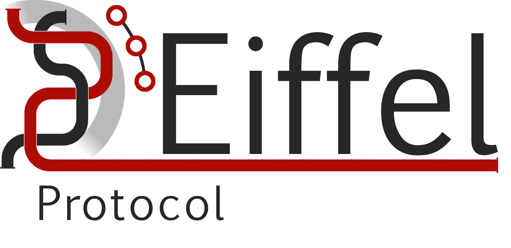

# Eiffel Event Aggregator

This github repository was created as a part of Johan Christiansson and Lukas Ekbergs master thesis project. 

The goal of the project was the find a better way to detect patterns in a continously growing graph of Eiffel Events. In this repo different tools were tested and evaluated. To read more see [Master Thesis Report](./Master_Thesis_Report.pdf)

Four tools have been tested:
* <a href="https://neo4j.com" style="color: blue; text-decoration: underline;">Neo4j</a> 
* <a href="https://memgraph.com" style="color: blue; text-decoration: underline;">Memgraph</a> 
* <a href="https://nightlies.apache.org/flink/flink-docs-master/docs/libs/cep/" style="color: blue; text-decoration: underline;">FlinkCEP</a> 
* <a href="https://github.com/eiffel-community/eiffel-intelligence" style="color: blue; text-decoration: underline;">Eiffel Intelligence</a> 


## 1. Neo4j
To run and test Neo4j follow the tests:

1. Download Neo4j Graph database [here](https://neo4j.com/deployment-center/#gdb-tab)

2. Download RabbitMQ [here](https://www.rabbitmq.com/docs/download)

3. Set up .env file, see [placeholder](./.env)

4. Make sure Eiffel Events are available, to generate events run: 
 python RabbitMQ/GeneratedEvents/generator.py
 Or use existing events which for best performance should be downloaded using:
 python RabbitMQ/SendEREvents/get_events.py

5. Start Neo4j and create a database instance, see [instructions for desktop version](https://neo4j.com/docs/desktop/current/operations/instance-management/) and start RabbitMQ container 

6. Create indexes on Neo4j and install triggers using apoc, see [Cheat sheet](#cypher-cheat-sheet)

Now all the different parts should be set up. Next, start using the tool.

7. run: python RabbitMQ/SendEREvents/connect_rabbitmq_neo4j.py &
 to create the connection between RabbitMQ and Neo4j

8. run: python Server/server.py &
   to be able to receive notifcations from triggers, ensure the endpoint exists, or create it!

9. run: python RabbitMQ/LogQueueData/log_queue_data.py
   to start logging information about the queues and resource usage.

10. Lastly, to start publishing the events run:
    RabbitMQ/SendEREvents/send_to_rabbitmq.py -graphdb -file
    Assuming the events have been downloaded using get_events.py

## 2. Memgraph

The setup for Memgraph is very similar to Neo4j but have some key differences

1. Download Memgraph [here](https://memgraph.com/docs/getting-started)

2. Download RabbitMQ [here](https://www.rabbitmq.com/docs/download)

3. Set up .env file, see [placeholder](./.env)

4. Make sure Eiffel Events are available, to generate events run: 
 python RabbitMQ/GeneratedEvents/generator.py
 Or use existing events which for best performance should be downloaded using:
 python RabbitMQ/SendEREvents/get_events.py

5. Start Memgraph and create a database instance, see [instructions](https://memgraph.com/docs/getting-started) and start RabbitMQ container 

6. Create indexes on Neo4j and install triggers using apoc, see [Cheat sheet](#cypher-cheat-sheet)

Now all the different parts should be set up. Next, start using the tool.

7. run: python EiffelEventAggregator/RabbitMQ/SendEREvents/memgraph_connect.py &
 to create the connection between RabbitMQ and Memgraph

8. run: python Server/server.py &
   to be able to receive notifcations from triggers, ensure the endpoint exists, or create it!

9. run: python RabbitMQ/LogQueueData/log_queue_data.py
   to start logging information about the queues and resource usage.

10. Lastly, to start publishing the events run:
    RabbitMQ/SendEREvents/send_to_rabbitmq.py -graphdb -file
    Assuming the events have been downloaded using get_events.py

## 3. Flink

The Flink approach was abandoned quite early due to poor initial results.
To run the code, small changes will most likely need to be done such as changing to the correct queue inside the java code [here](Demos/FlinkDemo/src/main/java/mypackage/source/Source.java).

1. Download Flink [here](https://nightlies.apache.org/flink/flink-docs-release-2.0/docs/try-flink/local_installation/)

2. Download RabbitMQ [here](https://www.rabbitmq.com/docs/download)

3. Make sure Eiffel Events are available, to generate events run: 
 python RabbitMQ/GeneratedEvents/generator.py
 Or use existing events which for best performance should be downloaded using:
 python RabbitMQ/SendEREvents/get_events.py

4. Compile the flink code to a fat jar using maven.

5. Start the containers for RabbitMQ and Flink. 

6. Submit the jar file a as a job to the flink cluster see [instructions](https://nightlies.apache.org/flink/flink-docs-release-2.0/docs/try-flink/local_installation/#submitting-a-flink-job)

7. Lastly, to start publishing the events run:
   RabbitMQ/SendEREvents/send_to_rabbitmq.py -graphdb -file
   ensure the correct queue is used.

8. Wait for it to shut down due to heavy memory usage..

## 4. Eiffel Intelligence

1. Create a docker container for Eiffel Intelligence and related services following the [instructions here](https://github.com/eiffel-community/eiffel-intelligence)

2. Set up .env file, see [placeholder](./.env)

3. Make sure Eiffel Events are available, to generate events run: 
 python RabbitMQ/GeneratedEvents/generator.py
 Or use existing events which for best performance should be downloaded using:
 python RabbitMQ/SendEREvents/get_events.py

5. Create Aggregation rules [se example](EiffelIntelligence/example_aggregation_rule.json) and Subscriptions [se example](EiffelIntelligence/ArtP_Subscription/example_subscription.json) view the eiffel intelligence [github](https://github.com/eiffel-community/eiffel-intelligence) for more detail

Now the the different parts are available. Either modify and use [run_test.sh](run_test.sh) or write the steps one at a time

6. Start the Eiffel Intelligence docker with correct          aggregation rule, run:
   docker compose -f Eiffel/ArtC/docker-compose.yml up -d

7. Add subscriptions, run: 
   add_subscriptions.py EiffelEventAggregator/EiffelIntelligence/ArtP_Subscription Artifact_Created --count 1
   Check the file for alternative arguments.

8. run: python Server/server.py &
   to be able to receive notifcations from triggers, ensure the endpoint exists, or create it!

9. run: python RabbitMQ/LogQueueData/log_queue_data.py
   to start logging information about the queues and resource usage.

10. Lastly, to start publishing the events run:
RabbitMQ/SendEREvents/send_to_rabbitmq.py -eiffel -file
Assuming the events have been downloaded using get_events.py

# Cypher cheat sheet

This part will describe how it should be used for Neo4j, but can with only small modifications be used for Memgraph to.

## Triggers

Example trigger of the artifact created pattern:

    :use system;
    CALL apoc.trigger.install(
    'neo4j',
    'send_http_request',
    'WITH [n IN $createdNodes WHERE n.type = "EiffelArtifactCreatedEvent"] AS nodes
    UNWIND nodes AS n
    MATCH (n)-[:FLOW_CONTEXT]->(e:Event {type:"EiffelFlowContextDefinedEvent"})
    CALL apoc.load.jsonParams(                                                                                                                         
        "http://localhost:5000/event_ArtC",                                                                                                                 
        {`Content-Type`: "application/json"},                                                                                                          
        apoc.convert.toJson({ArtC: n.id, FCD: e.id})     
    ) YIELD value
    RETURN NULL',
    {phase:"afterAsync"}
    );

The three core parts are the following:
1. 
```
    'WITH [n IN $createdNodes WHERE n.type = "EiffelArtifactCreatedEvent"] AS nodes
```

Which describes which the initial node the pattern should start filtering on, in this case it the pattern should try to match every time a EiffelArtifactCreatedEvent is inserted.

2.
```
CALL apoc.load.jsonParams(                                                                                                                         
    "http://localhost:5000/event_ArtC",                                                                                                                 
    {`Content-Type`: "application/json"},                                                                                                          
    apoc.convert.toJson({ArtC: n.id, FCD: e.id})     
) YIELD value
```
Which describes which information should be sent and to which endpoint.
3.
```
MATCH (n)-[:FLOW_CONTEXT]->(e:Event {type:"EiffelFlowContextDefinedEvent"})
```
The match statement which describes how the pattern should look. It is possible to filter both on a pattern structure but also on different attributes for the nodes.

It is also possible to write queries for patterns of flexible length see [here](PossibleUsecases/EntirePipeline/pattern.txt)

For further details view [Neo4j docs on cypher queries](https://neo4j.com/docs/cypher-manual/current/queries/)

## Index

To maintain good performance over time it is important to create indexes to enable efficient looksup for the triggers.

Neo4j: CREATE INDEX event_id_index FOR (e:Event) ON (e.id);

Memgraph: CREATE INDEX ON :Event(id);